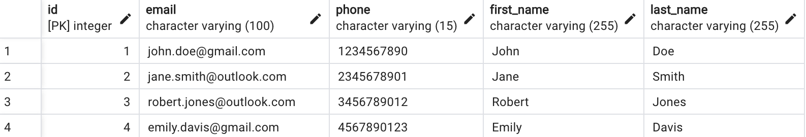
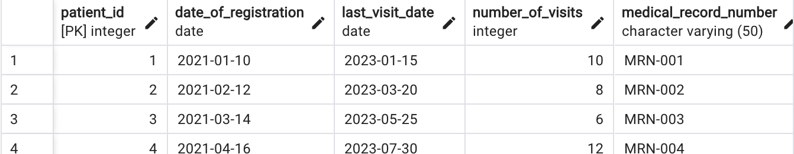

# Translating Natural Text → SQL Queries to Fetch Data (WIP)

## Problem Space
Structured Query Language (SQL) databases are where many varying sized businesses store their data. To access this data, a specific SQL programming language is required. This translation exercise is left to the few stakeholders who are literate in SQL, but this means the data isn't immediately accesible to everyone. The use case is for a General Practitioner to access patient details with the following application.

## Tech Stack
- SQL
    - Hosting postgres sql database
- AWS SageMaker
    - Deep Learning Containers
    - Studio
    - Deployment
    - Requests
- HuggingFace
    - Open Source Models
    - Datasets
- OpenAI
    - API wrappers
- Transformers
    - ~~Fine Tuning~~
        - Synthetic Data Generation

- Quantization
- Prompt Engineering
 

## Project Files
 

| File                  | Description                                                                                      |
|-----------------------|--------------------------------------------------------------------------------------------------|
| `app.py`              | Intermediary between the user, model, and database                                                |
| `db.py`               | app.py functionalities for database communication and SQL execution   |
| `evaluate.ipynb`      | Notebook for evaluating the model                                                                |
| `generate_data.ipynb` | Notebook detailing the process for generating synthetic data                                     |
| `llm.py`              | OpenAI access and prompt engineering                                               |
| `aws_llm.ipynb`    | A duplicate of the AWS model jupyter notebook. Configuration and deployment of a sharded Mistral 7B                                       |
| `generate.py`    | Contains prompt engineering required to ensure a consistent output from GPT-4 that will allow the application to function                                  |

## Overview of Agent Application 
The translation exercise from the user's casual enquiry to SQL programming language is assigned to a Large Language Model (LLM). This model is hosted on AWS, and has been fine tuned for improved performance in this use case. The agent will also be equipped with visibility on the database and functionalities to parse out and run SQL queries. 

### App Function:
1. **User submits a question** on a patient database using colloquial language.
 User - *'What is John Doe's email?'*

2. **Give visibility of database to LLM**
 App - *Extracts table definitions from database, LLM will then analyse*

3. **LLM constructs an SQL query to satisfy user request**
  Model - Analyses SQL schema, creates SQL query e.g.
*'SELECT email FROM patients WHERE ...'*

4. **Query the SQL database** and return the correct information to the user.
  → Run the SQL query, user receives the relevent data.

## Overview of Process
1. **Host a postgres sql database**
 Patient data was generated by gpt-4.
2. **Develop the agent**
 Body: `app.py`, `db.py`
To provide the agent with tools to access and query an postgreSQL database. To also provide visibility of said database to the models.
 Brain: `lmm.py` (ChatGPT-4), `aws_llm.py` (Mistral 7B Instruct) To analyse the SQL schema and perform the translation task to formulate the correct SQL query. 

3. **Fine-tuning (WIP)** 
**a. Curate datasets**
  Use a relevant HuggingFace dataset `b-mc2/sql-create-context` to train the Mistral 7B model on. Suppliment it with synthetic data generated by ChatGPT-4. 
**b. Train the Mistral 7B model**
 Functionality is not quite consistent. Attempt to improve performance by finetuning with SQL dataset.
6. **Evaluate (WIP)**
 Develop an evaluation method to test the capabilities of llms pre and post fine-tuning.

## 1. Host postgreSQL database
Used `pgadmin` to host a postgres database locally. The data was generated by gpt-4 since patient data is scarce.
| Table          | Size          |Description                                               |
|----------------|----------------|-----------------------------------------------------------|
| patients   |(20, 5) | Patient's name and contact information         |
| clinic_info | (20, 5) | Patient interactions with clinic and other information     |
 

 

## 2. Develop the Agent

Refer to `app.py` and `db.py` to understand the functionalities of the 'body' of the agent. A few more details on the 'brain' aka the models:

### 2a. OpenAI API
ChatGPT 4 is one of the leading models to date. I have access to their state-of-the-art model through their API, and integrated it to this application successfully. The configuration of the model can be found in `llm.py`.

### 2b. Host on AWS SageMaker 
SageMaker is an AWS service that provides a way to train and deploy transformer models directly on AWS servers.   After testing the application with OpenAI's GPT-4 model containing 1.7 trillion parameters, I chose a more modest sized LLM to replace it - `Mistral 7B`. Reason for choosing Mistral 7B is because it has achieved Llama2 13B performance on all benchmarks due to algorithmic design. In effect, this model is a lot more cost efficient. With a 'ml.g5.xlarge' instance, further adjustments had to be made for the 7B model to be loaded and used for inference such as:
1. Using a sharded version of Mistral 7B
2. Quantisation (8 bits)

The code can be found under `aws_llm.ipynb`.

1. **Create an AWS session** using SageMaker Studio.
2. **Access the Mistral 7B** model through Hugging Face's Deep Learning Containers (DLC).
3. **Deploy** the model.
4. **Application invokes** AWS SageMaker endpoint - the model that powers the translation exercise from colloquial to SQL query. 

## 3. Curate dataset for finetuning (Work in Progress)
The performance of the model isn't quite there, and can be improved with a related dataset. Base models are found to be notably much more useful when fine-tuned. The composition of data is divided into `synthetic data` which I generated using gpt-4, and a much larger text-to-sql database. The combination will provide guidance on how the LLM should format its' responses and will improve general capabilities for this exercise.

| Dataset                | Size | Description |
|------------------------|------|-------------|
| Synthetic Data         | (60, 3)     | Generated by gpt-4 with specific examples to the database.            |
| b-mc2/sql-create-context | (78600, 3)     | A more generalised dataset with natural language queries being translated to sql queries.            |

## 4. Evaluate (Work in Progress)
To assess the effectiveness of fine-tuning, a comparison between the model's are to be made. gpt-4, mistral base model, and SQL mistral.

# Example: "what is the email of John Doe?"

## Output
1. MODIFIED_PROMPT: what is the email of John Doe? Use these TABLE_DEFINITIONS to satisfy the database query:

TABLE_DEFINITIONS

CREATE TABLE patients (
    id integer DEFAULT nextval('patients_patient_id_seq'::regclass) NOT NULL,
    email character varying NOT NULL,
    phone character varying,
    first_name character varying,
    last_name character varying
); Respond in the format found under TABLE_RESPONSE_FORMAT. Insert the relevant information within <>, don't include the <> symbols, keep the ---------.

TABLE_RESPONSE_FORMAT

<insert an explanation of the sql query as raw text here>
 ---------
<insert sql query exclusively as raw text here>
            
2. PROMPT_RESPONSE: This query selects the email of the patient named "John Doe"

            ---------
SELECT email FROM patients WHERE first_name = 'John' AND last_name = 'Doe'
            
3. RUN_SQL_QUERY: SELECT email FROM patients WHERE first_name = 'John' AND last_name = 'Doe'
 -------- POSTGRES AI AGENT RESPONSE --------- 
[('john.doe@gmail.com',)]

